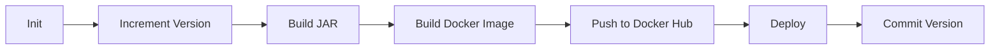

<div align="center">

# ☕ Java Maven Application

### Spring Boot Demo App with Automated CI/CD Pipeline

[](https://www.java.com/)
[](https://spring.io/projects/spring-boot)
[](https://maven.apache.org/)
[](https://www.docker.com/)
[](https://www.jenkins.io/)
[](https://www.digitalocean.com/)


</div>

---

## 📋 Table of Contents

- [Overview](#-overview)
- [Features](#-features)
- [Tech Stack](#-tech-stack)
- [Project Structure](#-project-structure)
- [Getting Started](#-getting-started)
- [CI/CD Pipeline](#-cicd-pipeline)
- [Docker Deployment](#-docker-deployment)
- [Jenkins Setup](#-jenkins-setup)
- [Version Management](#-version-management)
- [Contributing](#-contributing)

---

## 🎯 Overview

A simple **Spring Boot** application demonstrating a complete **CI/CD workflow** using **Jenkins**, **Maven**, **Docker**, and **DigitalOcean**. The project showcases automated building, testing, versioning, and deployment of a Java application.

**Jenkins** is deployed in a Docker container on **DigitalOcean** droplet, providing a scalable and cloud-native CI/CD solution.

---

## ✨ Features

- ⚡ **Spring Boot 2.3.4** - Lightweight web application framework
- 🏗️ **Maven Build System** - Dependency management and build automation
- 🐳 **Docker Containerization** - Portable application packaging
- 🔄 **Automated CI/CD** - Jenkins pipeline with automatic version bumping
- 📦 **Docker Hub Integration** - Automated image push to registry
- 🔢 **Semantic Versioning** - Automatic version increment on each build
- 📝 **Git Integration** - Automatic version commit to repository
- ☁️ **Cloud-Ready** - Deployed on DigitalOcean infrastructure
- 📊 **Logging** - Logback with Logstash encoder support

---

## 🛠️ Tech Stack

### Backend
- **Java 8** - Programming language
- **Spring Boot 2.3.4** - Application framework
- **Maven 3.9** - Build tool

### DevOps
- **Jenkins** - CI/CD automation server (running in Docker on DigitalOcean)
- **Docker** - Containerization platform
- **Docker Hub** - Container registry
- **DigitalOcean** - Cloud infrastructure provider

### Tools & Libraries
- **JUnit 4.13.1** - Testing framework
- **Logstash Logback Encoder** - Structured logging
- **Amazon Corretto 8** - Docker base image

---

## 📁 Project Structure

```
java-maven-app/
├── src/
│   └── main/
│       └── java/
│           └── com/example/
│               └── Application.java    # Spring Boot main class
├── target/                             # Build artifacts
├── Dockerfile                          # Docker image definition
├── Jenkinsfile                         # CI/CD pipeline configuration
├── script.groovy                       # Pipeline helper functions
├── pom.xml                            # Maven configuration
└── README.md                          # This file
```

---

## 🚀 Getting Started

### Prerequisites

- Java 8 or higher
- Maven 3.6+
- Docker (optional, for containerization)

### Local Development

1. **Clone the repository**
   ```bash
   git clone <repository-url>
   cd java-maven-app
   ```

2. **Build the application**
   ```bash
   mvn clean package
   ```

3. **Run the application**
   ```bash
   java -jar target/java-maven-app-1.1.0-SNAPSHOT.jar
   ```

4. **Access the application**
   ```
   http://localhost:8080
   ```

### Docker Build

1. **Build the Docker image**
   ```bash
   docker build -t java-maven-app:latest .
   ```

2. **Run the container**
   ```bash
   docker run -p 8080:8080 java-maven-app:latest
   ```

---

## 🔄 CI/CD Pipeline

The Jenkins pipeline automates the entire build, test, and deployment process:

### Pipeline Stages

1. **🔧 Init** - Load Groovy helper scripts
2. **📈 Increment Version** - Automatically bump semantic version
3. **🏗️ Build JAR** - Compile and package with Maven
4. **🐳 Build Image** - Create Docker image and push to Docker Hub
5. **🚀 Deploy** - Deploy application (placeholder for deployment logic)
6. **💾 Commit Version** - Push updated version back to Git repository

### Pipeline Flow



### Jenkinsfile Example

```groovy
pipeline {
    agent any
    tools {
        maven 'maven-3.9'
    }
    stages {
        stage('increment version') {
            steps {
                script {
                    sh 'mvn build-helper:parse-version versions:set ...'
                }
            }
        }
        stage('build jar') {
            steps {
                script {
                    sh 'mvn clean package'
                }
            }
        }
        stage('build image') {
            steps {
                script {
                    sh "docker build -t artnagornyi/demo-app:${IMAGE_NAME} ."
                    sh "docker push artnagornyi/demo-app:${IMAGE_NAME}"
                }
            }
        }
    }
}
```

---

## 🐳 Docker Deployment

### Dockerfile

The application uses a lightweight **Amazon Corretto 8 Alpine** base image:

```dockerfile
FROM amazoncorretto:8-alpine3.17-jre

EXPOSE 8080

COPY ./target/java-maven-app-*.jar /usr/app/
WORKDIR /usr/app

CMD java -jar java-maven-app-*.jar
```

### Image Details

- **Base Image**: `amazoncorretto:8-alpine3.17-jre`
- **Exposed Port**: `8080`
- **Working Directory**: `/usr/app`

---

## 🔧 Jenkins Setup

### Jenkins on DigitalOcean

Jenkins is deployed as a Docker container on a **DigitalOcean** droplet for easy scaling and maintenance.

#### 1. Deploy Jenkins on DigitalOcean

```bash
# SSH into your DigitalOcean droplet
ssh root@your-droplet-ip

# Run Jenkins in Docker
docker run -d \
  -p 8080:8080 -p 50000:50000 \
  -v jenkins_home:/var/jenkins_home \
  --name jenkins \
  jenkins/jenkins:lts
```

#### 2. Configure Jenkins

1. Access Jenkins at `http://your-droplet-ip:8080`
2. Install required plugins:
   - **Git Plugin**
   - **Docker Pipeline Plugin**
   - **Maven Integration Plugin**
3. Configure credentials:
   - `docker-hub-repo` - Docker Hub username/password
   - `GitHub-pat` - GitHub Personal Access Token

#### 3. Configure Maven Tool

1. Go to **Manage Jenkins → Global Tool Configuration**
2. Add Maven installation:
   - **Name**: `maven-3.9`
   - **Install automatically**: ✅

#### 4. Create Pipeline Job

1. **New Item → Pipeline**
2. **Pipeline Definition**: Pipeline script from SCM
3. **SCM**: Git
4. **Repository URL**: Your Git repository URL
5. **Script Path**: `Jenkinsfile`

---

## 🔢 Version Management

The project uses **automatic semantic versioning** with Maven:

### Version Format

```
MAJOR.MINOR.PATCH-BUILD_NUMBER
```

Example: `1.1.3-42`

### Automated Version Bumping

```bash
mvn build-helper:parse-version versions:set \
  -DnewVersion=\${parsedVersion.majorVersion}.\${parsedVersion.minorVersion}.\${parsedVersion.nextIncrementalVersion} \
  versions:commit
```

This increments the **PATCH** version on each build automatically.

---

## 📝 Requirements

### Development
- Java 8+
- Maven 3.6+
- Git

### CI/CD
- Jenkins 2.x+ (running in Docker)
- Docker installed on Jenkins agent
- DigitalOcean account (for cloud deployment)

### Credentials Required
- **docker-hub-repo**: Docker Hub credentials
- **GitHub-pat**: GitHub Personal Access Token (for version commits)

---

## 🔐 Security Notes

- All credentials are stored securely in Jenkins Credentials Manager
- Docker Hub password is never exposed in logs
- GitHub token uses fine-grained permissions
- Application runs as non-root user in Docker container

---

## 🤝 Contributing

Contributions are welcome! Please follow these steps:

1. Fork the repository
2. Create a feature branch (`git checkout -b feature/AmazingFeature`)
3. Commit your changes (`git commit -m 'Add some AmazingFeature'`)
4. Push to the branch (`git push origin feature/AmazingFeature`)
5. Open a Pull Request

---

## 📄 License

This project is open source and available under the [MIT License](LICENSE).

---

## 📞 Contact & Support

For questions or support, please open an issue in the repository.

---

<div align="center">

**Built with ❤️ for DevOps and Cloud Engineering**

Jenkins on DigitalOcean 🚀 | Docker | Spring Boot | Maven

</div>
